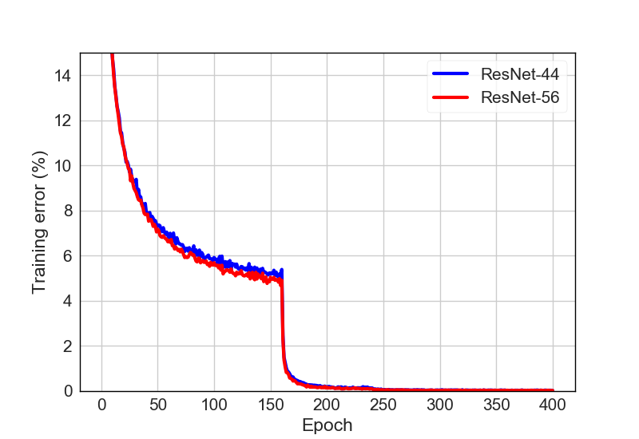
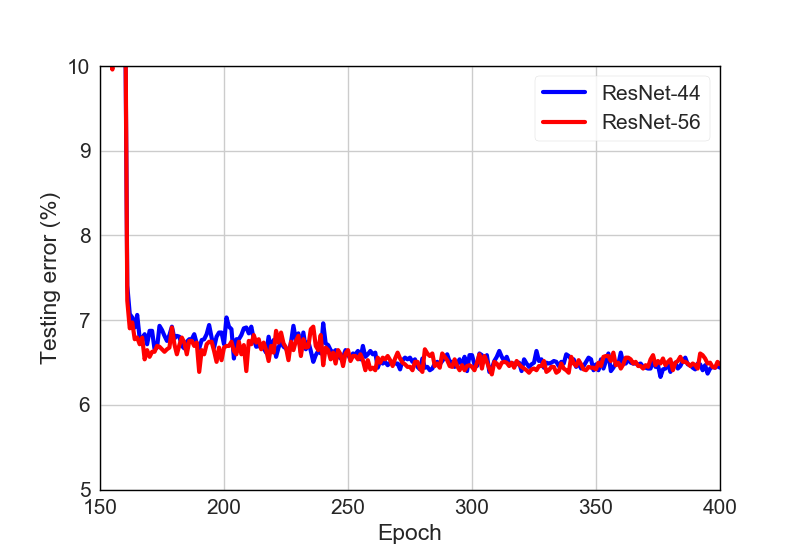

# Draw experimental curves
---

## Pipeline

The pipeline of this code is shown as follows, we firstly parse the .txt files to obtain experiment data. Then we define attributes of lines and figure. Finally, we can draw the curves with the pre-defined attributes.


## Parse file

Data in .txt file is formated by "%d\t%f\t%f\t%f\t%f\t%f\t%f\t\n"%(epoch, train\_top1\_error, train\_loss, test\_top1\_error, test\_loss, train\_top5\_error, test\_top5\_error). We show part of the data in the file as follows:
```
0	55.3756	1.4869	44.1555	1.2911	9.9736	5.2017	
1	34.6843	0.9742	39.8635	1.2053	3.1262	3.4711	
2	27.3230	0.7794	26.1373	0.7660	1.8946	1.7207	
3	23.0742	0.6653	23.3188	0.7091	1.4798	1.4537	
4	20.5191	0.5947	22.3892	0.6614	1.0910	1.2263	
5	18.8651	0.5444	24.6143	0.7608	0.9171	1.4933	
6	17.4269	0.5013	19.6499	0.5928	0.7992	0.8801	
7	16.2832	0.4710	21.2025	0.6534	0.7525	0.8208	
8	15.5163	0.4477	18.7599	0.5739	0.6554	0.8900	
9	14.7115	0.4257	20.2136	0.6433	0.5635	1.3548	
10	14.2543	0.4087	19.1258	0.5604	0.5215	0.7812
```

We define class TextParse to parse the file, and obtain results whose data type is np.ndarray. The example is shown as follows:

```python
file_parse = TextParse("./database/cifar10_resnet44_baseline.txt")
data = file_parse()
```

## Lines

We define class Line to help defining the attribute of curves, the example is shown as follows:
```python
line = Line(label="ResNet-44", data=data[3], color="blue")
```

## Figures

Base on pre-defined lines, we can draw curves by calling draw() simply.
```python
figure = Figure(figure_name="cifar10_resnet_testing",
                x_lim=[150, 400], y_lim=[5, 10],
                xlabel="Epoch",
                ylabel="Testing error (%)")

figure.draw(lines=line)
```
## Results
1. Training curves



2. Testing curves


